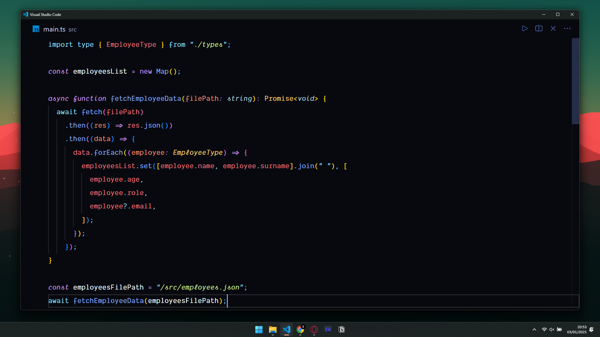
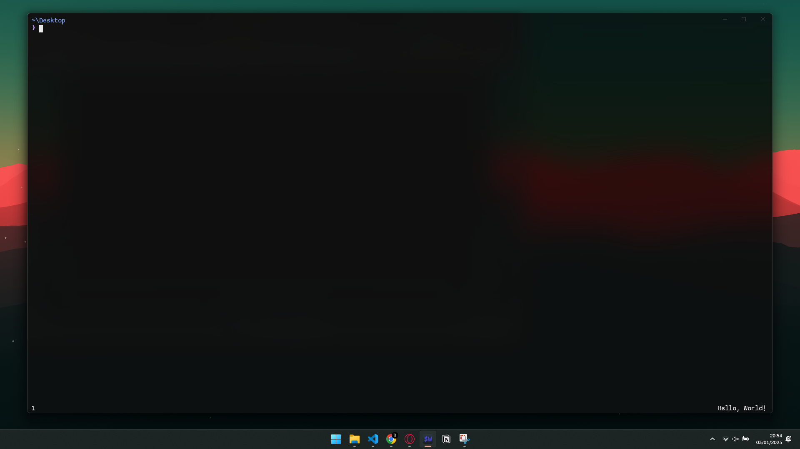

# My VSCode and Wezterm configs!
I've spent a lot of time for these configs...⏲️

## VSCode
Some good settings that I use:
- Theme: Aurora X
- Font: Dank Mono
- AI: Codeium AI
- Screenshots: CodeSnap
- Icons: Material Icon Theme
- Product Icons: Fluent Icons

## Wezterm
Some good settings that I use:
- Theme: Tokyo Night
- Font: Comic Mono
- Shell: PowerShell

## Previews

